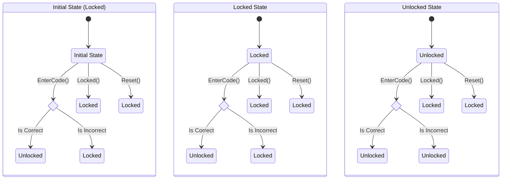

### NatalieRekai_Lab5
# Smart Lock Test

```mermaid
stateDiagram-v2

    initSt: Initial State (Locked)
    state initSt {
        init: Initial State
        state if_state1 <<choice>>
        l1: Locked
        l2: Locked
        l3: Locked
        u1: Unlocked
        [*] --> init
        init --> if_state1 : EnterCode()
        if_state1 --> u1 : Is Correct
        if_state1 --> l1 : Is Incorrect
        init --> l2 : Locked()
        init --> l3 : Reset()
    }


    lockedSt: Locked State
    state lockedSt {
        locked: Locked
        state if_state2 <<choice>>
        l4: Locked
        l5: Locked
        l6: Locked
        u2: Unlocked
        [*] --> locked
        locked --> if_state2 : EnterCode()
        if_state2 --> u2 : Is Correct
        if_state2 --> l4 : Is Incorrect
        locked --> l5 : Locked()
        locked --> l6 : Reset()
    }


    unlockedSt: Unlocked State
    state unlockedSt {
        unlocked: Unlocked
        state if_state3 <<choice>>
        l7: Locked
        l8: Locked
        u3: Unlocked
        u4: Unlocked
        [*] --> unlocked
        unlocked --> if_state3 : EnterCode()
        if_state3 --> u3 : Is Correct
        if_state3 --> u4 : Is Incorrect
        unlocked --> l7 : Locked()
        unlocked --> l8 : Reset()
        
    }    
    
```
